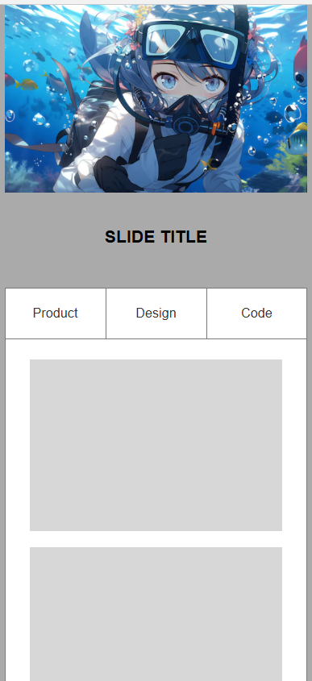

# Dynamic Panels Practical - Day 05

This repository documents the **Day 05** practical session for **IT3213 Human Computer Interaction (HCI)**, focusing on **dynamic panels** and  **scroll-triggered animations**.

---

## Practical Overview 
The goal of this session is to implement a **fixed navigation bar**. 

---

## Day 05 Progress - Fixed Navbar

### Fixed Navigation Bar with Dynamic Panel 
1. **Dynamic Panel Setup**:
   - Grouped navbar icons (Home, Programs, Classes, Videos) into a dynamic panel.
   - **Pinned to Browser**: Positioned at the **top center** of the screen.
2. **Scroll Interaction**:
   - Show/hide the navbar dynamically based on scroll position (`Window.scrollY`).

## Demo

## How to Use the Axure RP 9 File 
1. Download and install **Axure RP 9** if you haven't already.
2. Open the `.rp` file provided in this repository.
3. Navigate through the pages using the **Page Navigator** in Axure RP 9.
4. Preview the prototype by clicking the **Preview** button to see the interactions in action.

---

---

## Hosted Project on Axure Cloud 
The project will be hosted on **Axure Cloud** for easy access and interaction. You can view the live prototype by clicking the link below:

🔗 **[Axure Cloud Project Link](https://uc8sri.axshare.com)**  

---

## License 📜
This project is licensed under the MIT License. See the [LICENSE](LICENSE) file for details.
